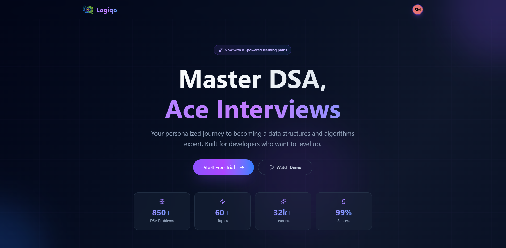
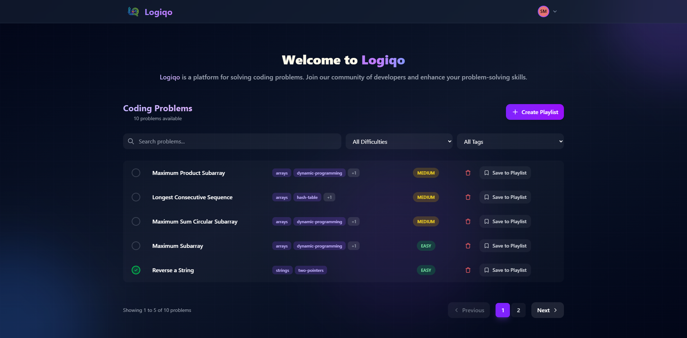
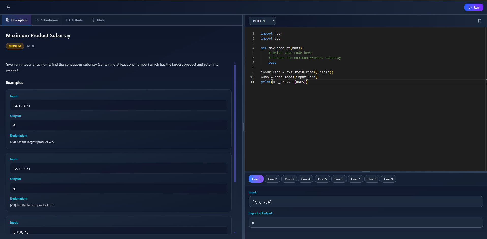
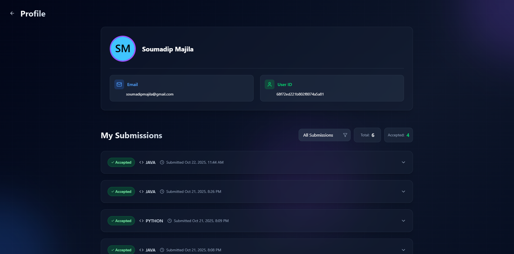

<h1 align="center">
  <br>
  Logiqo 🖥️
  <br>
</h1>

<p align="center">
  Logiqo is a LeetCode-inspired platform for developers to practice coding in JavaScript, Python, and Java.
</p>

<table align="center">
  <tr>
    <td align="center">
     
    </td>
    <td align="center">
  
    </td>
  </tr>
  <tr>
     <td align="center">
    
    </td>
    <td>
       
    </td>
  </tr>
</table>

## 🌐 Live Demo

[Logiqo](https://logiqo-temp.vercel.app/)

## 🌟 Features

- **Interactive Code Editor** – Built with Monaco Editor for real-time coding and testing.
- **Detailed Problem Descriptions** – Includes explanations, examples, constraints, and hints for each challenge.
- **Automated Test Cases** – Runs predefined tests to validate solutions.
- **Multi-Language Support** – Supports JavaScript, Python, and Java.
- **Submission Tracking** – Displays memory usage, runtime, and status (Accepted, Wrong Answer, etc.).
- **Profile Section** – View personal details and track solved problems and playlists.
- **Playlist Creation** – Create and organize custom playlists by topic or difficulty.
- **Responsive Design** – Optimized for all devices with a modern UI.

## ⚙️ Tech Stack

- **Frontend**: React.js, Tailwind CSS, Monaco Editor, Zustand, Zod, React Hook Form
- **Backend**: Node.js, Express.js
- **Database**: PostgreSQL with Prisma ORM (supports Docker or Neon DB)
- **Authentication**: JWT (JSON Web Tokens)
- **Code Execution**: Judge0 API (via RapidAPI)

## 🛠️ Installation & Setup

### Prerequisites

- Node.js (v18+)
- npm or yarn
- PostgreSQL database
- RapidAPI account for Judge0 API

### 1. Clone the repository

```bash
git clone https://github.com/soumadip-dev/Logiqo-PERN.git
cd Logiqo-PERN
```

### 2. Backend Setup

```bash
cd server
npm install
```

Create a `.env` file in the `server` directory:

```env
PORT=<server_port>
FRONTEND_URL=<frontend_url>
DATABASE_URL=<database_url>
NODE_ENV=<development|production>
JWT_TOKEN_SECRET=<your_random_secret_key>
JWT_TOKEN_EXPIRY=<token_expiry_duration>
RAPIDAPI_KEY=<your_rapidapi_key_judge0>
RAPIDAPI_HOST=<your_rapidapi_host_judge0>
JUDGE0_API_URL=<your_judge0_api_url>
```

### 3. Frontend Setup

```bash
cd ../client
npm install
```

Create a `.env` file in the `frontend` directory with:

```env
VITE_BACKEND_URL=<YOUR_BACKEND_URL>
VITE_FRONTEND_URL=<YOUR_FRONTEND_URL>
```

### 4. Run the Application

- **Backend (Terminal 1):**

```bash
cd server
npm run dev
```

- **Frontend (Terminal 2):**

```bash
cd client
npm run dev
```

<!--
After every change in the Prisma schema:
npx prisma generate
npx prisma migrate dev
npx prisma db push
-->
