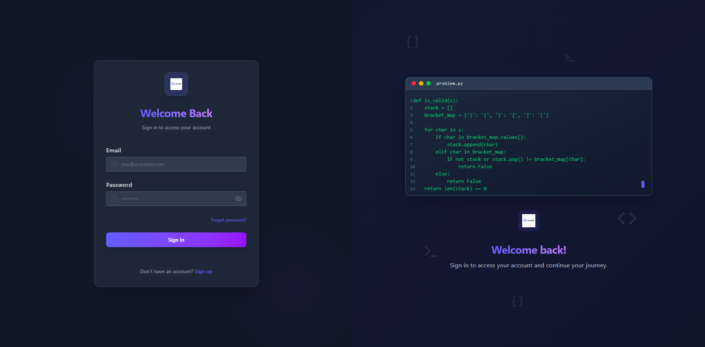

<h1 align="center">
  <br>
  Logiqo 🖥️
  <br>
</h1>

<p align="center">
  Logiqo is a LeetCode-inspired platform for developers to practice coding in JavaScript, Python, and Java.
</p>

<div align="center">
  
</div>

## 🌟 Features

- 🧠 **Interactive Code Editor** – Built with Monaco Editor for real-time coding and testing.
- 📖 **Detailed Problem Descriptions** – Comprehensive explanations, examples, constraints, and hints for each challenge.
- 🧪 **Automated Test Cases** – Validate solutions by running them against predefined tests.
- 🌍 **Multi-Language Support** – Solve problems using JavaScript, Python, or Java.
- 📈 **Submission Tracking** – Monitor memory usage, runtime, and status (✅ Accepted, ❌ Wrong Answer, etc.).
- 📱 **Responsive Design** – Works seamlessly on all devices with a modern UI.

## ⚙️ Tech Stack

- **🎨 Frontend**: React.js, Tailwind CSS, Monaco Editor, Zustand
- **🚀 Backend**: Node.js, Express.js
- **🗄️ Database**: PostgreSQL with Prisma ORM
- **🔐 Authentication**: JWT (JSON Web Tokens)
- **🖥️ Code Execution**: Judge0 API

## 🛠️ Installation & Setup

### Prerequisites

- Node.js (v18+)
- npm or yarn
- PostgreSQL database
- RapidAPI account for Judge0 API

### 1. Clone the repository

```bash
git clone https://github.com/soumadip-dev/Logiqo-PERN.git
cd Logiqo-PERN
```

### 2. Backend Setup

```bash
cd server
npm install
```

Create a `.env` file in the `server` directory:

```env
PORT=<server_port>
FRONTEND_URL=<frontend_url>
DATABASE_URL=<database_url>
NODE_ENV=<development|production>
JWT_TOKEN_SECRET=<your_random_secret_key>
JWT_TOKEN_EXPIRY=<token_expiry_duration>
RAPIDAPI_KEY=<your_rapidapi_key_judge0>
RAPIDAPI_HOST=<your_rapidapi_host_judge0>
JUDGE0_API_URL=<your_judge0_api_url>
```

### 3. Frontend Setup

```bash
cd ../client
npm install
```

Create a `.env` file in the `frontend` directory with:

```env
VITE_BACKEND_URL=<YOUR_BACKEND_URL>
VITE_FRONTEND_URL=<YOUR_FRONTEND_URL>
```

### 4. Run the Application

- **Backend (Terminal 1):**

```bash
cd server
npm run dev
```

- **Frontend (Terminal 2):**

```bash
cd client
npm run dev
```

<!--
After every change in the Prisma schema:
npx prisma migrate dev --name shift-to-linux
npx prisma generate
npx prisma db push
-->
